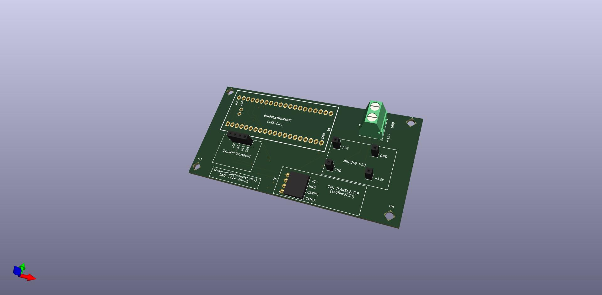

# pda_hardware
A repo for all the hardware and wiring schematics.

## PCB Modular Version Preview

This version of the PCB is focused on being able to swap out componets 
rapidly.

## Schematic Preview

